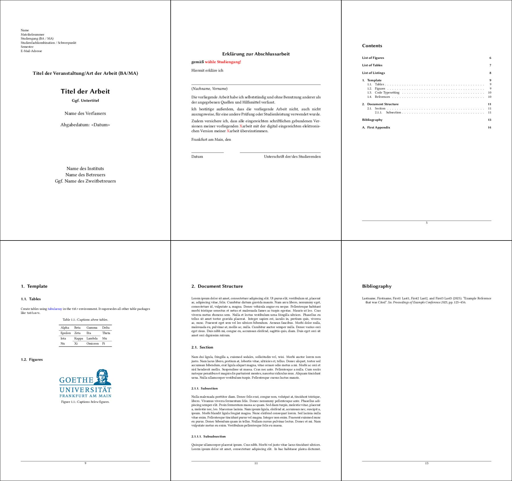

# TTLab-LaTeX-Template
LaTeX template for theses and term papers at the TTLab.

- See [`ttlab-qualify.cls`](ttlab-qualify.cls) file for preloaded packages and class options. 
- See the ["Resources for Theses"](https://www.texttechnologylab.org/teaching/resources/) for some formal guidance on how to write a thesis. 
- Always refer to the [Examination Office](https://www.uni-frankfurt.de/103337868/Pruefungsamt) for current regulations, especially regarding the _Erklärung zur Abschlussarbeit_!

